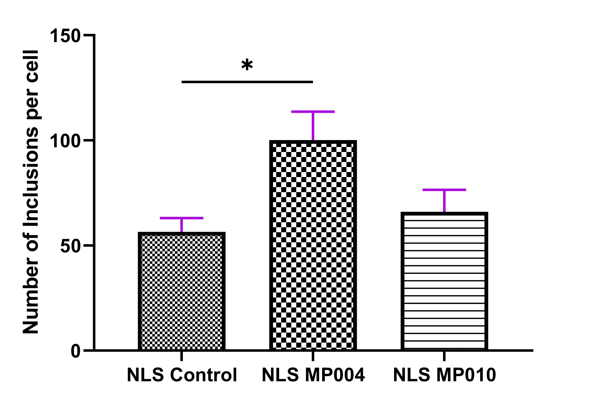

::: text-justify
\newpage

# Introduction

In our PSY6404 mini-project, our objective was to generate or replicate a graph using existing data. We aimed to introduce novel analyses, if feasible, and enhance the visual appeal of the graph. Moreover, in line with the principles of reproducibility and transparency, the [*complete project*](https://github.com/carlospzhz/PSY6422_Project) is publicly accessible.

The data set under examination is sourced from an undergraduate dissertation titled "The effects of calcium modulators on TDP-43 function and development of a new co-localization protocol in ALS cellular models". This dissertation encompasses diverse data types, with numerous graphs featured in the lab report. While several graphs could benefit from aesthetic enhancements, we focused on one specifically for this mini-project (Figure 1 A). Ultimately, the raw data is available in the [*github repositery*](https://github.com/carlospzhz/PSY6422_Project).

## Original Figure

```{r, echo=FALSE, out.width="100%", fig.align = 'center', fig.cap = "**Average number of TDP-43 inclusions**: Quantification of average number of TDP-43 inclusions in controls (53.52, SEM +/- 5.39) and cells treated with MP004 (99.98, SEM +/- 12.71) and MP0010 (65.20, SEM +/- 9.00), n=50. * p<0.01."}

```

The original data was plotted using bar plots in *GraphPad Prism 9.5.1*, initially aligning with the intended visualization of the data set. The results revealed an **increased number of TDP-43 inclusions with MP004**. However, the current graph lacks the ability to illustrate the distribution of individual data points. This information is crucial for understanding whether the observed increase in TDP-43 inclusions with MP004 is due to a general augmentation of inclusions across all cells or if it's primarily driven by a rise in the frequency of cells with significantly higher numbers of inclusions.

Before delving into the specifics of data manipulation and coding, it's crucial to familiarize the reader with key concepts that will be instrumental throughout this portfolio.

## Background Information

Amyotrophic lateral sclerosis (ALS) is a neurodegenerative disease characterized by the demise of upper and lower motor neurons, with no efficient therapies currently available [@taylorDecodingALSGenes2016]. **TDP-43 protein pathology** is observed in nearly 97% of ALS patients, characterized by **aberrant aggregation** and nuclear loss-of-function (LOF), which is believed to be **toxic and ultimately leads to neurodegeneration** [@sukRoleTDP43Mislocalization2020].

In the report two different newly synthesized triazoles called Ahulkens (AHKs) where studied, with **MP010** being able to cross the blood brain barrier (BBB) and **MP004** unable to cross it. These compounds, modulate calcium homeostasis as a potential therapeutic treatment for ALS. The effects of AHKs where tested in cellular **models of TDP-43 cytoplasmic mislocalization,** using a TDP-43^ΔNLS^ construct [@zhangDualFunctionsExtreme2013].

The results chosen for this mini-project were derived from fluorescence microscopy analysis.

```{r, echo = FALSE, out.width="100%", fig.cap= "Representative images of cytoplasmic TDP-43 inclusions formed in U2OS cells transiently transfected with a TDP-43ΔNLS construct fused with GFP treated with 500(nM) of AHK at 4 hours after transfection and collected at 24 hours post-transfection"}
knitr::include_graphics("images/cells_image.jpg")
```

## Codebook

Some definitions and descriptions to help the reader digest the new information.

|    Key words     | Description                                                                                                                                                                                                             |
|:------------------------------------:|:---------------------------------|
|    **TDP-43**    | A heterogeneous nuclear ribonucleoprotein (hnRNP) primarily located in the nucleus. Its pathological state is characterized aggregation and nuclear loss [@françois-moutal2019].                                        |
| **TDP-43^ΔNLS^** | A TDP-43 construct with a mutated Nuclear Localisation Signal (NLS), fused with a green fluorescence protein, used to model the mislocalization to the cytoplasm of TDP-43 *in vitro* [@zhangDualFunctionsExtreme2013]. |
|    **MP004**     | A triazole unable to cross the BBB. Modulates calcium homeostasis by enhancing between the FKBP12 protein and the Ryanodine receptors (RyR).                                                                            |
|    **MP010**     | A triazole able to cross the BBB. Modulates calcium homeostasis by enhancing between the FKBP12 protein and the Ryanodine receptors (RyR).                                                                              |

# Motivation and Aims

The objective of this module project is to recreate the graph using the original data in R, aiming to achieve the following:

1.  Develop a visualization that improves upon the aesthetics of the existing graph, enhancing its visual appeal and clarity.
2.  Create a visualization that facilitates the interpretation of the obtained data, offering insight of the distribution of inclusions for each condition.

# Code Outline & Visualization

This section will outline the code used for the recreation of the graph.

## Setup and Preparation

First, the required packages will be checked for installation and loaded.

```{r packages, message = FALSE, warning = FALSE}
# ---- Install, attach and load R packages ----

# A loop that will install all the listed packages if needed
packages <- c("openxlsx", "writexl", "ggplot2", "tidyverse", "here", "ggstatsplot", "ggsignif")
for (i in packages) {
  if (!require(i, character.only = TRUE)) install.packages(i)
}

library(openxlsx)
library(writexl)
library(ggplot2)
library(tidyverse)
library(here)
library(ggstatsplot)
library(ggsignif)
library(paletteer)
```

Subsequently, the data is imported, from the excel file provided. This data is already in wide format, as it was previously processed using *ImageJ* - a program commonly used for immunofluorescence analysis.

```{r import data}
# ---- Extract raw data ---- 
rawdata <- read.xlsx(here("data", "raw_data.xlsx"), sheet = "raw_data")

head(rawdata) # Visualize raw data
```

Next, the data is transformed into long data for an easier processing of the data in R.

```{r transform data}
# ---- Transform the data into long data ----
long_data <- rawdata %>%
  gather(key = "Condition", value = "Number of inclusions per cell")   # Condition is used for control, MP004 and MP010

head(long_data)   # Visualize format of data
```

The long data is saved into a new document.

```{r export long data, eval=FALSE}
# Export processed data to a new document
write_xlsx(long_data, path = here("data", "processed_data.xlsx"))
```

## Code for Data Visualization

For enhancing the visual presentation of the graph, we explored various methods in `ggplot2` including **box plots**, and **violin plots**, each offering distinct advantages and drawbacks. Box plots provide a succinct summary of essential statistics such as the **median** and **quartiles**, crucial for our visualization. On the other hand, violin plots offer insights into the **distribution** and **variability** of the data, enriching our understanding of the data set and targeting our aims.

Consequently, our preference leaned towards the utilization of the `ggbetweenstats` function, a feature-rich tool offered by the `ggstatsplot` package. This function, serving as an extension of the renowned `ggplot2`, was chosen for its capability to seamlessly integrate multiple graph types, including both box plots and violin plots. This integration simplifies the process of generating our visualization, ensuring efficiency in our analytical endeavors. Moreover, the function boasts the additional capability to conduct tailored statistical tests and seamlessly embed the results directly into the graph, further enhancing its analytical depth. Furthermore, the function offers an extensive array of parameters and arguments, affording us the flexibility to fine-tune various aspects of the graph's appearance to achieve optimal aesthetic appeal. The following code snippet delineates the implementation of this methodology:

```{r visualization, eval=FALSE, warning=FALSE, message=FALSE}
# ---- Plot a graph with the long data ----
p <- ggbetweenstats(
  data = long_data,
  
  # All necessary labels for graph
  x = Condition,
  y = `Number of inclusions per cell`,
  title = "Average number of TDP-43 inclusions",
  results.subtitle = FALSE,  
  xlab = "",   # No need to apply a label as the code will automatically produce for each condition
  ylab = "Number of inclusions per cell",
  
  # Parameters for stats
  type = "parametric",
  pairwise.display = "s",   # will plot only significant
  p.adjust.method = "bonferroni",
  digits = 2,   # will show 2 decimal places
  ggsignif.args = list(
    textsize = 4, 
    tip_length = 0.01
  ),
  centrality.type = "parametric",   # "parametric" will plot mean
  
  # Adjust visualization settings
  
  # customize the mean
  centrality.point.args = list(size = 5, 
                               color = "#CC0000"),
  #customize the label for the mean
  centrality.label.args = list(size = 4,
                               nudge_x = 0.4,
                               segment.linetype = 4,
                               min.segment.length = 0),
  # customize individual plots
  point.args = list(position = ggplot2::position_jitterdodge(dodge.width = 0.75), 
                    alpha = 0.7,
                    size = 5, 
                    stroke = 0),
  package = "khroma",   # changes package used
  palette = "okabeito"  # uses a colorblind-safe palette
) + 
  
  # removes right text displaying post-hoc test used
  theme(axis.title.y.right = element_blank(), 
        axis.text.y.right = element_blank(), 
        axis.ticks.y.right = element_blank())

p # load plot


# ---- Save plot and export as jpeg----
ggsave(
  filename = "./Figures/NEW_Avg_number_TDP43_inclusions.jpeg",
  dpi = 1200,
  width = 180,
  height = 170,
  units = "mm"
)
 # Nature publishing group criteria used
```

## New Visualization

```{r, echo=FALSE, out.width="100%", fig.align = 'center'}
knitr::include_graphics("figures/NEW_Avg_number_TDP43_inclusions.jpeg")
```

# Discussion

## Analysis of new graph

The revised figure integrates violin and box plots, offering a comprehensive visualization that combines the depiction of data distribution with key statistical insights. These complementary plot types facilitate a nuanced understanding of the data set by presenting both the distribution of numerical values and essential summary statistics. The median line within each box plot, as well as the mean, underscore the observed increase in TDP-43 inclusions, particularly evident for MP004, where statistical significance is noted, corroborating the primary observation derived from the initial bar graph: the increase in TDP-43 inclusions with MP004 (p-value = 0.01).

By incorporating individual data distribution and the use of box and violin plots, the figure elucidates how MP004 influences the amount of TDP-43 inclusions. Thus, exhibiting that there is a general augmentation of inclusions across all cells, observed with box plots quartiles, as well as a rise in the frequency of cells with significantly higher numbers of inclusions, exhibited with individual data and violin plots. Notably, for MP010, the plot highlights a distribution pattern more akin to MP004 than the control, albeit without statistical significance, suggesting a similar interaction between AHKs and inclusions.

In summary, the utilization of violin and box plots enhances the interpretability of the data, providing valuable insights into the impact of MP004 and MP010 on TDP-43 inclusions.

## Aesthetics improvements

Numerous aesthetic enhancements have been implemented through this function:

1.  The inclusion of individual data points, differentiated by distinct colors, enhances visual clarity, effectively distinguishing between different experimental conditions. Additionally, employing transparency allows for the overlay of individual plots, indicating overlapping data points within the same region. Finally, the use of colours visible for people with common forms of colorblindness makes the graph barrier-free.
2.  The mean is highlighted in an opaque dark red hue (#CC0000), ensuring prominence amidst the data points (even for colorblindness). Furthermore, the label accompanying the mean provides precise information regarding the average number of inclusions per cell, enhancing accessibility to exact values.
3.  The total number of cells (n = 50) is prominently displayed on the graph, offering additional context and exact values into the study.
4.  The presentation of exact p-values offers a more precise representation of statistical significance. Furthermore, providing insight into the type of post-hoc test utilized to derive these values enhances the interpretability of the statistical findings.

## Limitations

While significant enhancements have been achieved in the visualization, it's crucial to acknowledge certain limitations:

1.  The utilization of box plots, while providing valuable statistical insights, does omit other important metrics such as the standard error of the mean (SEM) utilized in the original graph. Incorporating SEM values or even standard deviation (SD) alongside the box plots would bolster the comprehensiveness and robustness of the graph, offering a more comprehensive understanding of the data's variability.
2.  While violin plots effectively visualize the distribution of data points, they may appear distorted or misleading when dealing with a small number of points. In such cases, alternative visualization methods or careful consideration of plot interpretation may be necessary to ensure accurate representation of the data.

# Conclusions

## Use of R

The utilization of R and RStudio, alongside a plethora of packages and functions employed in the creation of the updated graph, has proven invaluable for enhancing the accuracy of data interpretation. This software environment has afforded numerous options and customization capabilities that were previously unavailable with other tools. By harnessing the power of R and leveraging its extensive ecosystem of packages, we have been able to unlock advanced analytical techniques and produce visualizations that offer deeper insights into the analyzed data. This enhanced functionality has greatly enriched our ability to explore and understand complex datasets, ultimately leading to more robust and nuanced interpretations.

## Reproducibility and replication

Employing R, particularly the dedicated function `ggbetweenstats` within the `ggstatsplot` package, ensures error mitigation and enhances the reproducibility of statistical analyses. This integrated functionality streamlines the analytical process, reducing the likelihood of mistakes and facilitating consistent results across multiple iterations. In addition, the straightforward and intuitive nature of the function makes it accessible to individuals with varying levels of coding proficiency, thereby democratizing statistical analysis and fostering broader participation in data-driven research endeavors. Ultimately, R's capacity to replicate and export data heralds a more efficient and rigorous future for scientific endeavors. Moreover, its accessibility, contingent upon an internet connection, ensures that barriers to entry are minimized, democratizing access to data analysis tools for individuals across diverse backgrounds. This democratization of data analysis not only fosters inclusivity but also empowers researchers, regardless of their geographical location or resources, to engage in rigorous scientific inquiry.
:::

# Bilbliography
